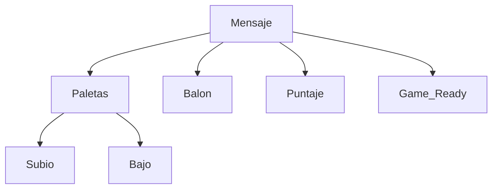

# Telepong

>**Integrantes** : Mateo Muñoz/David Fonseca/Carla Rendón


# Indice

1. Introducción
2. Desarrollo
	1. Aspectos importante
	2. UML Diagrama
 	3. Protocolo	 
	4. Cliente Pong
	5. Server pong
3. Conclusiones  
4. Referencias

# Introducción

El proyecto TelePong con Sockets es una implementación del juego Pong, una de las primeras creaciones de la industria de los videojuegos. Esta versión permite a dos jugadores enfrentarse en línea utilizando la red. Para lograr esta experiencia multijugador, el proyecto se basa en programación en C y sockets, lo que permite la comunicación en tiempo real entre los jugadores a través de una conexión de red. El servidor coordina las conexiones y el emparejamiento de los jugadores, mientras que los clientes se encargan de la jugabilidad real, el envío de comandos y la recepción de actualizaciones del juego. El entrelazado entre el servidor y los clientes permite que dos jugadores jueguen al Pong en línea en tiempo real.


# Desarrollo
## Aspectos importantes
En primer lugar, es fundamental destacar los aspectos que hemos tenido en consideración durante el proceso de desarrollo.
 ```c
server_socket = socket(AF_INET, SOCK_STREAM, 0);
```
* En el proceso de desarrollo, optamos por utilizar TCP debido a las ventajas que nos ofrece. Alguna de estas son:
1.  Coordinación precisa: TCP garantiza la entrega confiable y en el orden correcto de comandos, asegurando una coordinación precisa entre los jugadores.    
2.  Orden de eventos: TCP mantiene el orden de los eventos, crucial en el juego Pong, para que los movimientos se reflejen adecuadamente.   
3.  Entorno simple: Aunque Pong es simple, TCP sienta las bases para protocolos más complejos en juegos avanzados, ofreciendo comunicación fiable y orientada a la conexión.
4.  Compatibilidad con redes modernas: En redes actuales, la sobrecarga de TCP es menos relevante, y asegura que los datos lleguen sin errores, incluso en conexiones menos fiables, beneficiando a jugadores con distintas condiciones de conexión.

* La decisión de  implementación, la técnica de modo espejo en el juego se puede visualizar, de la siguiente manera:
1. El servidor empareja a dos jugadores y marca el inicio del "modo espejo" enviando un mensaje "GAME_READY" a ambos.    
2. Las paletas se dibujan en el lado derecho de la pantalla para ambos jugadores, ajustando las coordenadas de movimiento para crear la ilusión de estar en el lado derecho.  
3. La pelota se mueve reflejada, ajustando las coordenadas y velocidades para que ambos jugadores vean el movimiento correcto en sus pantallas.
4. El servidor y el cliente se comunican constantemente para mantener a ambos jugadores sincronizados, transmitiendo información sobre paletas, pelota y puntaje.
## UML diagrama
https://github.com/mmunozc/Pong-Game/blob/main/TelePong_page-0001.jpg
## Protocolo
> - "Subio" y "Bajo": se hace el cambio en el eje x segun la posición de la paleta.
> - Balon: manda la cordenada actual y la velocidad.
> - Puntaje: manda el puntaje actual del jugador.
> - Game_ready:da inicio al juego cuando las parejas estan emparejadas.


## Cliente pong

Se importan los módulos necesarios: pygame para la interfaz gráfica, random para generar números aleatorios, socket para la comunicación entre los jugadores y threading para manejar hilos.
 ```py
from time import sleep
import pygame
import random
import socket
import threading
import sys
```
Entre las funciones de mayor importancia podemos destacar:
1. ## recive_messages()
>Es responsable de recibir y procesar los mensajes enviados por el otro jugador a través de un socket en un hilo separado.
>La función recibe un argumento client_socket, que es el socket del cliente utilizado para la comunicación con el otro jugador.
````python
def receive_messages(client_socket):
````

#### Procesamiento de mensajes
>La función verifica el contenido de los mensajes recibidos para determinar cómo deben ser procesados.
> Distingue entre mensajes que actualizan la posición de la paleta, mensajes que informan sobre la posición de la pelota y mensajes que actualizan el puntaje. Esto se hace analizando el contenido del mensaje, que generalmente comienza con palabras clave específicas (por ejemplo, "SUBIO", "BAJO", "BOLA", "PUNTAJE", "GAME_READY").
````python
if  data.startswith("SUBIO ") or  data.startswith("BAJO "):
try:
action, value  =  data.split()
if  action  ==  "SUBIO":
new_paddle_b_y  =  float(value)
elif  action  ==  "BAJO":
new_paddle_b_y  =  float(value)
except  ValueError:
print("Error al analizar la posición recibida.")
````


#### Diferencia entre jugadores
>La función utiliza una variable auxiliar llamada aux para determinar qué jugador está enviando información y cuál debe recibirla. Si aux es par, se asume que el jugador actual es el "jugador 1", y si es impar, se considera al jugador actual como el "jugador 2". Esto permite que los mensajes se procesen de manera adecuada para mantener sincronizados a los jugadores.
````python
data.startswith("BOLA ") and  int(aux) %  2  !=  0:
````
````python
 data.startswith("PUNTAJE ") and  int(aux) %  2  !=  0:
````
````python
elif  data.startswith("BOLA ") and  int(aux) %  2  !=  0:
````
2. ## get_player()
>Esra función ermite que el jugador ingrese su nombre en el juego a través de la interfaz de usuario. Muestra una ventana donde el jugador puede escribir su nombre letra por letra y lo devuelve como resultado cuando el jugador presiona "Enter"

3. ## main()
````python
def  main():
````

#### Conexión a un Servidor 
>Establecer una vía de comunicación con el servidor, lo que permite la interacción entre los jugadores en un entorno multijugador y mantiene la sincronización y actualización del estado del juego a través de la red.
````python
client_socket = socket.socket(socket.AF_INET, socket.SOCK_STREAM)
    client_socket.connect((host, port))
````

 #### Inicialización de Pygame:

> Inicializa la biblioteca Pygame, que se utiliza para crear la interfaz gráfica y representar visualmente el juego.
 ````python
pygame.init()
````
 
    
#### Inicio del Hilo de Recepción:
>Crea un hilo separado (receive_thread) que se encarga de recibir mensajes del servidor de forma continua mientras el juego está en ejecución.
 ````python
receive_thread  =  threading.Thread(target=receive_messages, args=(client_socket,))

receive_thread.start()
````
    
#### Espera a que Ambos Jugadores se Unan:

>Espera a que el servidor indique que ambos jugadores están listos para comenzar el juego antes de avanzar 
```py
if int(aux) % 2 == 0:
        while not game_ready:
            print("Esperando a que el otro jugador se una...")
            pygame.display.update()
```


## Servidor pong 

> Incluyen las bibliotecas necesarias para la comunicación por sockets, la manipulación de hilos y otras funciones esenciales.
```c
#include <stdio.h>
#include <stdlib.h>
#include <string.h>
#include <unistd.h>
#include <arpa/inet.h>
#include <sys/socket.h>
#include <sys/select.h>
#include <pthread.h>`
```
1. ## handle_client()
>La función  se ejecutará en un hilo para manejar la comunicación con un cliente específico. Esta función toma `ThreadData` que se utiliza para pasar información a los hilos que manejarán la comunicación con los clientes. Contiene un puntero a la información de los clientes, el recuento de clientes y el índice del cliente en particular que manejará el hilo.
```c
ThreadData  *thread_data  = (ThreadData  *)data;

ClientInfo  *clients  =  thread_data->clients;

int  client_index  =  thread_data->client_index;
```
>En sistesis generales recibe datos del cliente, verifica si el cliente está emparejado y, si es así, envía los datos al compañero emparejado para permitir la comunicación bidireccional en el juego Pong. Si el cliente se desconecta, se cierra el socket del cliente y se finaliza el hilo del cliente.

1. ## main()

#### Creación y configuración del servidor
>  Se crea un socket del servidor utilizando socket() con la familia de direcciones  AF_INET y el tipo de socket SOCK_STREAM (TCP).Además se configura la dirección del servidor (server_addr) con el número de puerto definido (PORT) y la dirección IP para escuchar en todas las interfaces (INADDR_ANY).
```c
int  server_socket, new_socket;
struct  sockaddr_in  server_addr, new_addr;
socklen_t  addr_size;
fd_set readfds;
ClientInfo  clients[MAX_CLIENTS] = {0};
server_socket  =  socket(AF_INET, SOCK_STREAM, 0);
if (server_socket  <  0) {
perror("Error al crear el socket");
exit(1);}
printf("Servidor creado.\n");
server_addr.sin_family  = AF_INET;
server_addr.sin_port  =  htons(PORT);
server_addr.sin_addr.s_addr  = INADDR_ANY;
```
>también se se crea un archivo LogFile.txt que se utilizará para registrar eventos y actividades del servidor, se utiliza la función writeToLog() para escribir un mensaje que indica que el servidor ha sido creado.
```c
char  log_message[256];
snprintf(log_message, sizeof(log_message), "Servidor creado.\n");
writeToLog(log_message);
```
#### Vinculación del servidor a una dirección y puerto-Escucha de conexiones entrantes
>La función bind() vincula el servidor a una dirección y puerto específicos. Si tiene éxito, devuelve 0; de lo contrario, un valor negativo. Se verifica la vinculación, y si falla, se muestra un mensaje de error y se registra en un archivo de registro, cerrando el programa.
>La función listen() permite al servidor escuchar conexiones entrantes. Si tiene éxito, devuelve 0; de lo contrario, un valor negativo. Se verifica la configuración de escucha y, si es exitosa, se muestra un mensaje de confirmación. En caso de falla, se registra un mensaje de error, y el programa se cierra para finalizar la ejecución.


```c
if (bind(server_socket, (struct  sockaddr  *)&server_addr, sizeof(server_addr)) <  0) {
perror("Error en el binding");
///
char  log_message[256];
snprintf(log_message, sizeof(log_message), "Error en el binding");
writeToLog(log_message);
exit(1);
}
if (listen(server_socket, MAX_CLIENTS) ==  0) {
printf("Escuchando...\n");
///
char  log_message[256];
snprintf(log_message, sizeof(log_message), "Error en el binding");
writeToLog(log_message);
} else {
printf("Error en la escucha.\n"); 
///
char  log_message[256];
snprintf(log_message, sizeof(log_message), "Error en el binding");
writeToLog(log_message);
exit(1);
}
```
#### Gestión de actividad en el servidor:**
 >La condición if (FD_ISSET(server_socket, &readfds)) verifica si hay actividad en el socket del servidor. Si es así, significa que un cliente intenta establecer una nueva conexión.
> Se acepta la conexión entrante utilizando accept(), lo que crea un nuevo socket llamado new_socket para comunicarse con ese cliente.
 >La información del nuevo cliente, como su nombre, se recopila y almacena en el arreglo clients[].
 ```c
 if (FD_ISSET(server_socket, &readfds)) {
new_socket  =  accept(server_socket, (struct  sockaddr  *)&new_addr, &addr_size);
for (int  i  =  0; i  <  MAX_CLIENTS; i++) {
if (clients[i].client_socket  ==  0) {
char  aux[5];
clients[i].client_socket  =  new_socket;
 ```
#### Emparejamiento de clientes
>Se busca un cliente emparejable para el nuevo cliente en un bucle anidado. Los clientes se emparejan si no están emparejados previamente !clients[j].paired y si no son ellos mismos  i != j.
Si se encuentra un cliente emparejable, se establece un par de variables que indican que los clientes están emparejados. Se envía un mensaje al primer cliente emparejado para notificarle que el juego está listo GAME_READY.
```c
if (clients[j].client_socket  >  0  &&  !clients[j].paired  &&  i  !=  j) {
clients[i].paired  =  1;
clients[j].paired  =  1;
clients[i].partner_index  =  j;
clients[j].partner_index  =  i;
printf("Emparejando a %s y %s\n", clients[i].name, clients[j].name);
///
char  log_message[256];
snprintf(log_message, sizeof(log_message), "Empieza el juego entre %s y %s", clients[i].name, clients[j].name);
writeToLog(log_message);
char  game_ready_message[]  =  "GAME_READY";
send(clients[j].client_socket, game_ready_message, strlen(game_ready_message), 0);
```
# Conclusiones

* Se logró implementar una comunicación cliente-servidor eficiente utilizando el protocolo TCP. El servidor en C y el cliente en Python pudieron intercambiar datos, lo que permitió el control en tiempo real de las paletas y la pelota entre los jugadores.
* La modalidad espejo, donde una paleta refleja los movimientos del otro jugador, añadió un desafío al requerir sincronización precisa y comunicación efectiva entre los jugadores y el servidor.
* Durante el proyecto, se enfrentaron desafíos técnicos, como la sincronización precisa del juego y la gestión de múltiples conexiones de red. Estos desafíos impulsaron la búsqueda de soluciones creativas y la resolución de problemas.
* El proyecto contribuyó al desarrollo de habilidades técnicas y al enriquecimiento del conocimiento en programación de juegos y comunicación en red.

# Referencias


* https://csperkins.org/teaching/2007-2008/networked-systems/lecture04.pdf
* https://gamefaqs.gamespot.com/boards/916373-pc/67425559
* https://www.geeksforgeeks.org/tcp-server-client-implementation-in-c/
* https://beej.us/guide/bgnet/
* https://beej.us/guide/bgc/
    
